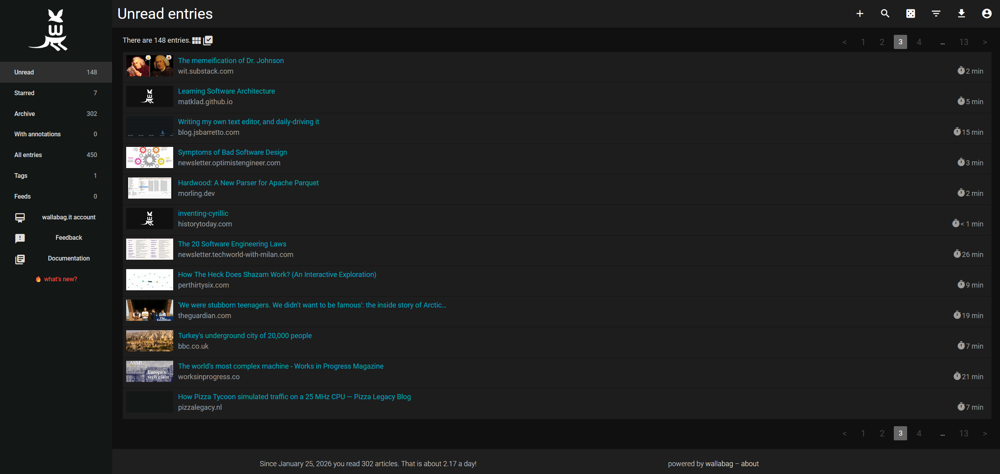
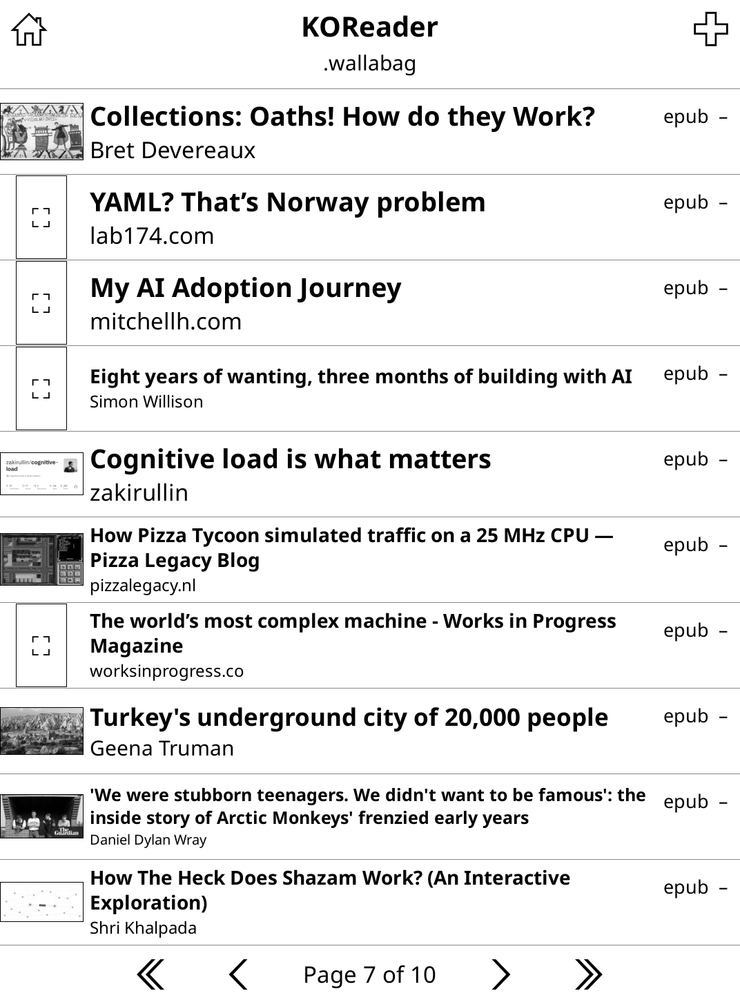
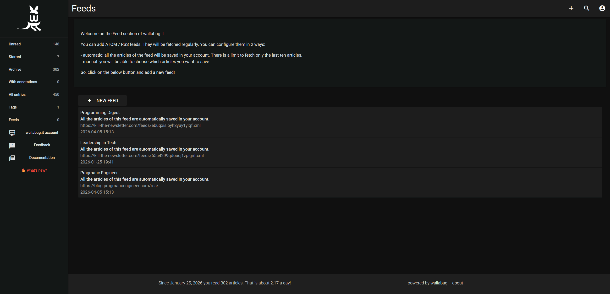
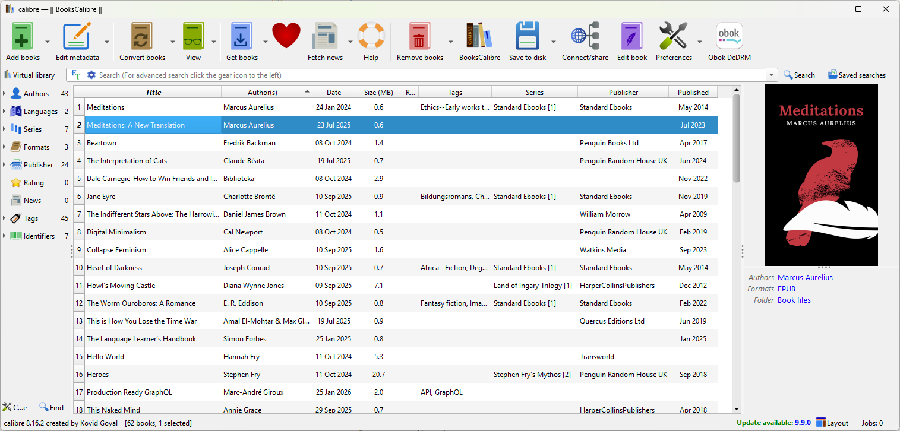

{height=500}

## Intro

I've gotten back into reading in the last couple of years.
What started as a way to put bedtime scrolling, well, to bed, reminded me of why I loved it in the first place.
I've explored new worlds, dove deeply into niche topics, and learnt all kinds of new things.

While I enjoy the feel of physical paper, I also love the convenience of an e-reader and the sheer amount of content it can have on it.
One of the original reasons I bought a Kobo Clara in the first place was the neat native integration with Pocket; a read-it-later service. I was using this to bookmark all manner of articles from history, to tech, to BBC News stories I didn't fancy reading at the time they popped up on my phone. I can also deposit any articles shared by friends or colleagues, storing them somewhere I'll not forget to read them.

When Mozilla [unexpectedly killed it last year](https://blog.mozilla.org/en/mozilla/building-whats-next/) though, I needed an alternative.

## Enter KOReader

[KOReader](https://koreader.rocks/) is an open-source alternative firmware for e-readers. It installs alongside the stock Nickel firmware on Kobo, and is also available for other brands. [^1]
On Kobo, at least, it doesn't replace Nickel but sits alongside it, meaning you can choose not to use once installed, and have the confidence to restore if needed.

It's highly customisable, though a little unintuitive. It's taken me some time to get it to a place I'm really happy with day-to-day, but was eventually rewarding. This guide is thus quite technical and as much to help me remember how to set it up, as help anyone reading discover any useful bits.

I've focused on a few useful aspects of my workflow for managing articles and eBooks.

### Wallabag

One of the main features on it is its integration with Wallabag; an open source alternative to Pocket. It's completely self-hostable, though for 11€/year you can get access to a solid instance hosted by the creator themselves. [^2]

I saved the [official bookmarklet](https://doc.wallabag.org/user/articles/save/#by-using-a-bookmarklet) to my bookmarks bar on my personal Firefox and work Chrome so that I can save things I'm interested in with one click.

Since it downloads each saved post as its own EPUB file, it is useful to separate into a separate folder away from the main books:

- `.wallabag` - toggle _"Show hidden files"_ temporarily.
- Plug in the e-reader and open `./settings/wallabag.lua` on PC (it's much easier to edit). Copy-paste client ID and secret. [^3]
- Retoggle _"Show hidden files"_ to hide the save folder.

{height=400}

#### Killing newsletters

You can also configure RSS Feeds on the Wallabag web app to stay up-to-date with certain blogs. I've been cutting down on emails recently and found that [Kill the Newsletter](https://kill-the-newsletter.com/) is a helpful tool here to turn mailing lists into RSS feeds.
This means I can convert my otherwise-spam into readable content in a form I'll actually read it.

### Calibre

[Calibre](https://calibre-ebook.com/) is a desktop app that makes managing eBooks really easy. It's very powerful and great for editing metadata to keep series together.

One note is to export all books to the root level of the device. This is a little messy when viewed in a file browser, but it allows me to see all books on the home screen in a mosaic fashion with their covers, in a manner closer to Kobo's stock UI.

### Other settings

- **Locking the home folder** (🗄️ -> _Settings_ -> _Home folder settings_ -> _Lock home folder_) - Locking the home folder makes it so you can't navigate around other hidden files in the file system above the home directory. Without this, I find it looks a bit hacky, and there's no real need to view system files on the Kobo itself.
- **Display** (🗄️ -> _Display mode_) - various options here for changing how books appear on the home screen.
- **Gestures** (⚙️ -> _Taps and gestures_) - you can configure various swipes, taps and double taps to map to common actions. A couple of my favourites are swiping up on the left to change screen brightness, and swiping up on the right to change screen warmth.
- **Reading history stats** (🛠️ -> _Reading statistics_) - various options in here to view stats about reading for the current book and history over time.
- **Searching menus** (🍔 -> _Help_ -> _Menu search_) - useful to search for a menu item and get its location; some of the menus can be hard to navigate and remember where everything is.

You can export a copy of the settings config to back them up as well. [This video](https://www.youtube.com/watch?app=desktop&v=jmurwwx5zIQ) gives a good overview.

# In closing

KOReader is a powerful tool for e-readers; something it owes a lot to its flexibility.
Tailoring it to something you find useful can take time but means you can have a reading setup that works nicely for you.

I may well add to this guide over time as I adjust bits or discover new things.

---

## Addenda

A couple of other points:

1. After a Kobo firmware update, it may not be possible to launch KOReader. This is because firmware updates break [kfmon](https://github.com/NiLuJe/kfmon) in the NickelMenu. To fix this, update kfmon using the [latest version](https://www.mobileread.com/forums/showpost.php?p=3797095&postcount=1). With these "one-click" packages (linked), it should be as simple as dragging the ZIP over the Kobo's root directory and unzipping the contents directly there.
2. Unfortunately after one such instance of the above, re-installing kfmon and NickelMenu didn't work. I found that the NickelMenu config file (`.adds/nm/config`) was missing. Inspecting `.adds/nm/koreader`, I found the comment suggesting adding `menu_item : main : KOReader : cmd_spawn : quiet : exec /mnt/onboard/.adds/koreader/koreader.sh` to the config file. Creating the file and adding this line fixed it for me.

---

[^1] Official README gives tailored [installation guides](https://github.com/koreader/koreader?tab=readme-ov-file#installation) for each device.
[^2] I did try self-hosting for a while on a mini PC but ran into some boring network issues that I never got round to solving.
[^3] Must restart KOReader once settings have changed! It isn't enough to simply wait for it to reload once the USB connection is done.
