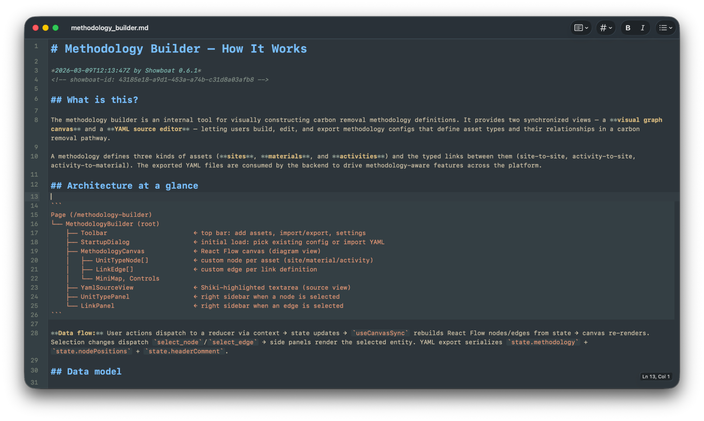

## Intro

As I've adapted my work recently to use AI more, I've started noticing something creeping in. Although I've been more productive in the short-term, there's a sense of "un-knowing" as I increasingly rely on it.

Some of the points I've learnt most as a developer have been when I've gotten curious, reading through library documentation or experimenting with new code. Shortcutting that process, while great for output, has made it harder to learn about how the code I'm changing actually works.

I was really interested by this, so wanted to explore more how I could still leverage AI while still keeping learning.

## Rhyming

The AI revolution we're currently living through rhymes strangely with the industrial revolution that came before it; both the benefits and downsides. I find history fascinating, seeing how real people lived through changes in the past can contextualise the present in unexpected ways.

We've seen some incredible uses of AI, many internally and there is a sense that we are living through a great change in our time at the moment.

## Craft

One kickback to industrialisation came from a set of designers, art critics and philosophers. Later known as the Arts and Crafts movement, its proponents criticised the decreasing quality of goods that factories could churn out, what they might nowadays call "slop", and the impact this had on the worker themselves.

Art critic John Ruskin wrote about the need for "the hand, the head, and the heart" of a craftsman to "go together", while designer and artist William Morris felt that craft was the process of a worker "exercising the energies of {their} mind and soul".

Both saw the inherent value of crafting on a person's spirit, but also worried about skills disappearing. As the production process became decoupled from the design of goods themselves, the traditional process of more senior craftsmen teaching the next generation began to break down, leaving new entrants to the field struggling to learn skills.

Indeed, a [recent study from Anthropic](https://www.anthropic.com/research/AI-assistance-coding-skills) on the formation of coding skills when using AI seems to support just this:

> Productivity benefits may come at the cost of skills necessary to validate AI-written code if junior engineers’ skill development has been stunted by using AI in the first place.
>
> ...
>
> For novice workers in software engineering or any other industry, our study can be viewed as a small piece of evidence toward the value of intentional skill development with AI tools. Cognitive effort—and even getting painfully stuck—is likely important for fostering mastery.

Wider industry echoes this trend, with a [25% fall in US entry-level tech jobs](https://www.finalroundai.com/blog/entry-level-jobs-disappearing-fast-because-of-ai) in 2024, while an increased focus on output can lead to ["brain fry"](https://hbr.org/2026/03/when-using-ai-leads-to-brain-fry) in workers from increased cognitive load.

Without the repetition of smaller, skill-building tasks ("putting in the reps") how do we learn while keeping pace with AI?

## What can we do?

Ruskin and Morris both focused on the revival of traditional craft guilds. These allowed knowledge to be transferred between generations, ensuring a continuity of learning.

The movement wasn't strictly anti-industry, but was concerned about how to incorporate the gains well into work.

An intentional focus on learning and maintaining skills was necessary.

### Guilds and workshops

We actually already have this same concept in Engineering at Isometric, in the form of web and backend guilds.
Workshops (such as recent Python and Kubernetes workshops) are something that colleagues have run internally which can be really valuable for gaining access to the experience of something new (but still relevant) to day-to-day work.
These enforce the value of doing something by hand to understand what happens when it's automated at scale.

### From producing to explaining

I've also been personally reframing my approach to Claude recently. It's very tempting to just pick up a task and chuck it into Claude, see that it spits out something seemingly sensible, and rubber stamp it.
This massively outsources my thinking and I've been finding leads to less knowledge over the part of the code being changed and less understanding in the long term.

Simon Willison recently developed a tool called [Showboat](https://github.com/simonw/showboat); a CLI app that can help an AI agent structure an explanation of code. This works equally well for new changes, as well as understanding unfamiliar areas of a codebase.[^1]

I've used this in a couple of interesting ways recently:

- **Explaining the structure of a vibe-coded prototype I built**. I was able to prompt Claude to output any particular quirks of the design or rougher parts which I then cleaned up after.
- **Understanding a new area of the codebase** which I hadn't worked in before. Using Showboat to explain it first gave me an idea of how I might implement it consistently within the codebase, before then doing it and checking the output against follow-up conversations with Claude.

### Structured learning

A colleague and I are currently reading a [book on GraphQL](https://book.productionreadygraphql.com/). At milestones, We've been discussing what we learnt and they had the smart idea of feeding a chapter into Claude to generate a quiz. This has helped it remain engaging, and also helped with knowledge retention.

It's a simple example, but it's possible there are much more sophisticated skills or internal apps we can build to aid learning.
We could imagine these being particularly valuable where they introduce an interactive element.

## Intentional curiosity

What all of these things have in common is a conscious approach to skill and knowledge building.

Intentional curiosity embodies this, allocating time and mental space for enquiry alongside output. This can be in the form of more formal organised workshops, or as a day-to-day practice in small moments while working.

Growing an ever stronger foundation isn't an alternative to AI; it allows us to get the most from it.

> _"We do not reject the machine, we welcome it. But we would desire to see it mastered"_ - C.R. Ashbee, architect and designer

[^1]: He has a [good writeup](https://simonwillison.net/2026/Feb/10/showboat-and-rodney/) as well.
